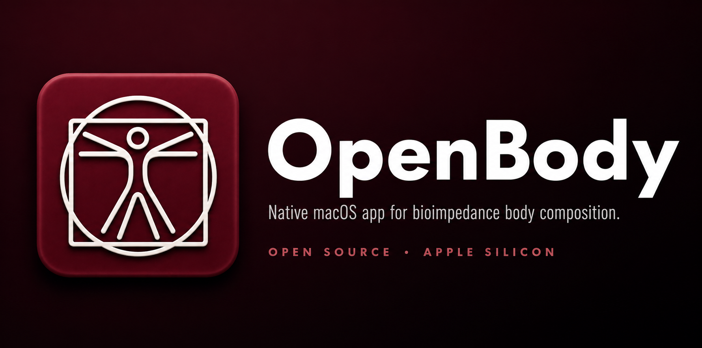

<p align="center">
  
</p>

# OpenBody

[English](README.md) · **Português**

**Um app nativo de macOS para ler, gerenciar, imprimir e enviar por e-mail exames de bioimpedância (composição corporal) da InBody.**

---

> **Sem qualquer vínculo, autorização ou endosso da InBody Co., Ltd.**
> Projeto independente de interoperabilidade. "InBody" é marca de seu respectivo dono. Use com a sua própria balança e os seus próprios dados, sob sua responsabilidade.

---

## Motivação

Sou médico do esporte. Tenho uma InBody 770 na clínica há dez anos, e o software dela só existe para Windows. Como toda a clínica roda em Mac, um PC ficava ligado num canto com uma única função: falar com a balança. Escrevi o OpenBody para aposentar esse PC.

## O que é

As balanças InBody vêm com um programa exclusivo para Windows para ler a balança, guardar pacientes e imprimir/enviar por e-mail as folhas de composição corporal. Não existe versão para Mac.

O **OpenBody** é um app nativo de macOS (SwiftUI) que faz o mesmo trabalho num Mac:

- Lê os exames do próprio banco da balança (`.mdb`), ou ao vivo pela balança.
- Desenha as **folhas de resultado** no layout que o paciente e o médico já conhecem, prontas para imprimir e enviar.
- Gerencia pacientes, imprime, envia as folhas em PDF por e-mail e faz backup do banco.

Ele existe para que uma clínica que roda em Macs não precise de uma máquina Windows só para usar a balança InBody.

## Modelos suportados

| Modelo | Folhas de resultado |
|--------|---------------------|
| **InBody 120** | Portada (ainda não testada) |
| **InBody 270** | Portada (ainda não testada) |
| **InBody 370S** | Portada (ainda não testada) |
| **InBody 770** | Portada e testada (adulto, água corporal, criança e histórico de composição corporal) |
| 570, 970, J, R, S10, BWA | Não iniciadas (a 770 serve de modelo) |

## Estado atual e limitações

Este é um app funcional usado numa clínica real, mas **não está completo em recursos**. Estado honesto:

- Os dados vêm da importação do banco **`.mdb`** da balança (ou de uma conexão ao vivo com a balança). O app não substitui o firmware da balança.
- A conexão ao vivo com a balança (rede / Bluetooth / USB / cabo serial) está implementada, mas precisa de testes em setups de clínica diferentes.
- Algumas funções do Setup ainda mostram um aviso honesto de "ainda não construído" (edição de histórico de tags/grupos; login na nuvem do fabricante).
- Alguns tipos de folha ainda estão abertos: Body Type, Comparação, Nutrição, Gordura Visceral, Interpretação.
- Apenas macOS. Compilado e rodado em Apple Silicon.

## Funcionalidades

Além do que o software original faz, o OpenBody traz funções que ele nunca teve:

- **Envio de exames pelo e-mail nativo do Mac**: abre o app de e-mail com o exame em PDF anexado, pronto para enviar, sem configurar nada. Uma tela de servidor SMTP fica disponível para quem quiser o próprio servidor.
- **Backup em nuvem** vinculando uma pasta do iCloud Drive, Google Drive, OneDrive ou similar
- **Fusão de pacientes** entre balanças e clínicas diferentes: junção automática por ID, com conferência nos conflitos (mescla, nunca apaga)

E o essencial do dia a dia:

- Lista de pacientes com busca, ordenação e colunas ajustáveis estilo Excel
- Exame InBody ao vivo por WiFi / serial
- **Folhas de resultado**: Folha InBody, Água Corporal, Criança, Histórico de Composição Corporal
- **Relatório de saúde** com gráficos de evolução por métrica (valor + data por exame)
- Impressão (com ajuste de alinhamento por clínica)
- Importação do banco `.mdb` da balança (mescla, nunca apaga)
- Backup do banco (cópia completa) + backup automático ao abrir
- Restauração de dados de um arquivo `.mdb` ou de um `.zip` de backup (sempre mescla)
- Exportação CSV / Excel, importação de cadastro em grupo
- Configurações completas (país, unidades, formato de data, impressora, logo personalizado, conta de e-mail, faixas de referência, etc.)
- Tela de login opcional e bloqueio automático de tela

## Requisitos

- macOS em Apple Silicon
- Uma balança InBody e/ou o arquivo de banco `.mdb` dela para importar

## Instalação (usuário final)

Baixe o `OpenBody.dmg` em **Releases**, abra e arraste o **OpenBody** para **Aplicativos**. Ele é assinado e notarizado pela Apple, então abre normalmente, sem nenhuma gambiarra de segurança.

## Compilar do código-fonte

```bash
swift build --product OpenBody -c release
```

A leitura de arquivos `.mdb` usa binários do **mdbtools**, embutidos no `Contents/Helpers` do app. O projeto compila e roda completo sem nenhuma configuração adicional.

## Arquitetura

- **Swift 6 / SwiftUI**, compilado com **SwiftPM**.
- `InBodyKit`: a camada de comunicação com a balança (rede/serial), escrita do zero em Swift.
- `InBodyApp`: o app (UI, desenho das folhas, banco, serviços).
- `inbody`: uma pequena CLI usada durante o desenvolvimento.
- As folhas de resultado foram validadas com pelo menos 17.000 exames reais, exame por exame.
- Os bancos InBody são arquivos Access `.mdb`, espelhados em SQLite localmente; alguns campos são criptografados em AES.

## Como contribuir

Contribuições são muito bem-vindas. Áreas de maior valor:

1. **Testar os modelos portados**: as folhas da 120 / 270 / 370S estão portadas mas ainda não validadas contra exames reais (a 770 está pronta e testada; serve de modelo).
2. **Mais tipos de folha**: Body Type, Comparação, Nutrição, Gordura Visceral, Interpretação, etc.
3. **Mais modelos de balança**: a 570 / 970 / J / R / S10 / BWA seguem abertas.
4. **Testar a conexão ao vivo com a balança** em modelos InBody e redes diferentes.
5. Build e teste em **Mac Intel**.
6. Traduções além de pt-BR / en.

Abra uma issue descrevendo o que quer fazer, ou envie um pull request. Mantenha a regra do "nenhum clique mudo": todo botão ou funciona ou diz claramente o que está faltando.

## Licença

[MIT](LICENSE). Use, modifique e redistribua livremente, mantendo o aviso de copyright.

## Apoie este projeto

**Toda doação é encaminhada integralmente ao [GACC Vale](https://hospitalgaccvale.org.br)**, hospital de São José dos Campos que atua no diagnóstico e tratamento de crianças e jovens de 0 a menores de 19 anos com suspeita de câncer e doenças onco-hematológicas.

[](https://www.paypal.com/donate/?hosted_button_id=G5BZG5KEWYC9N)
